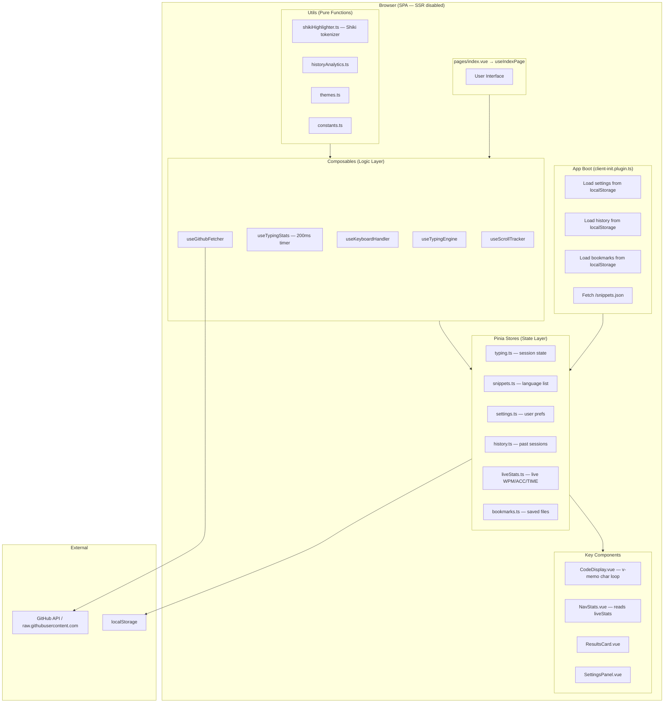
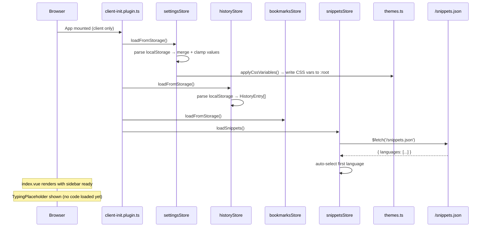
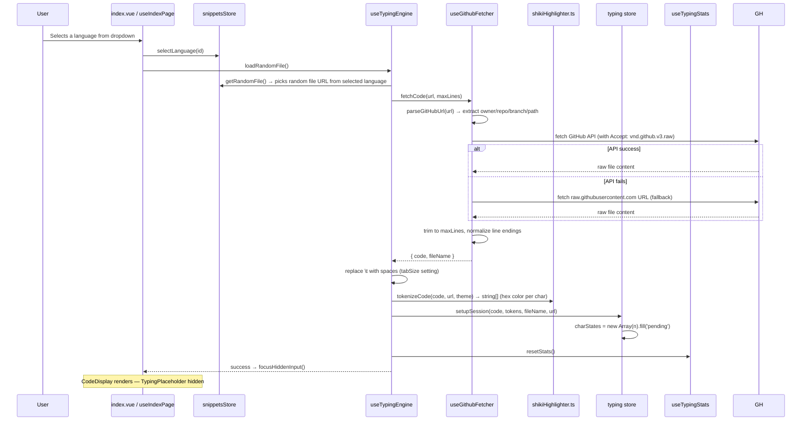
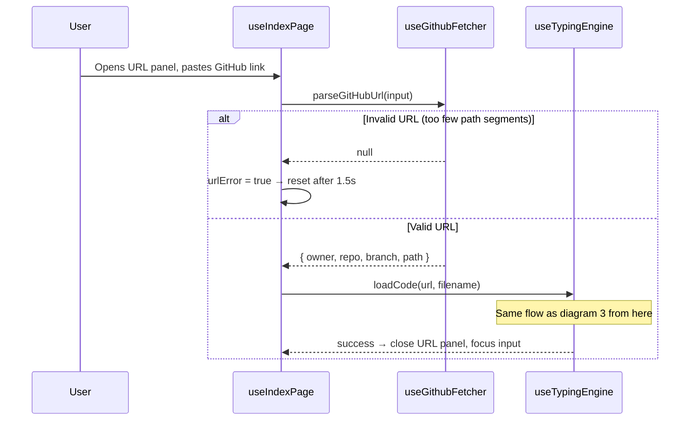
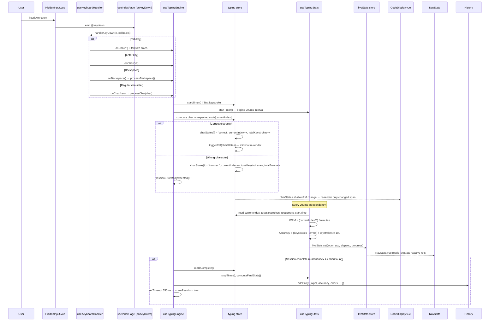
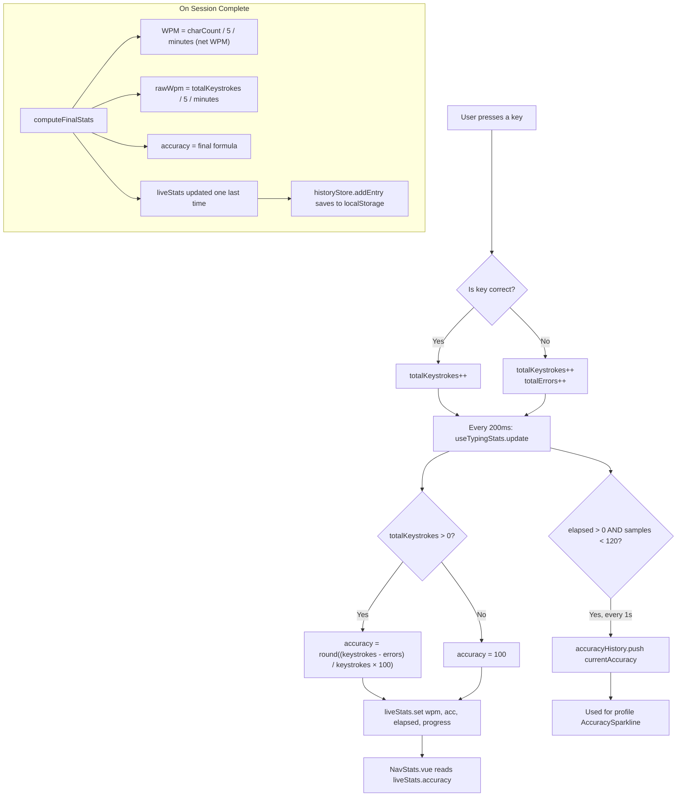
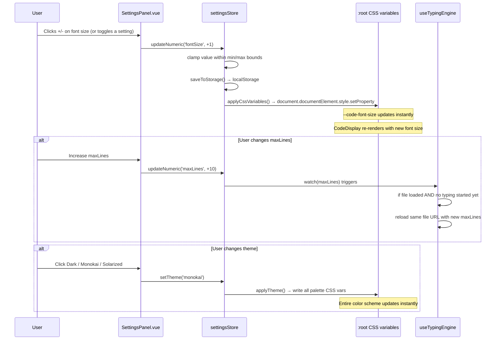
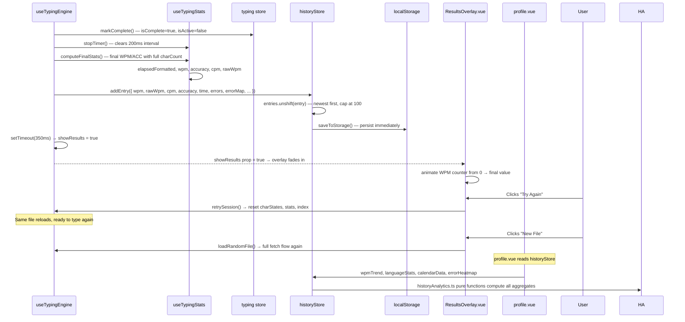
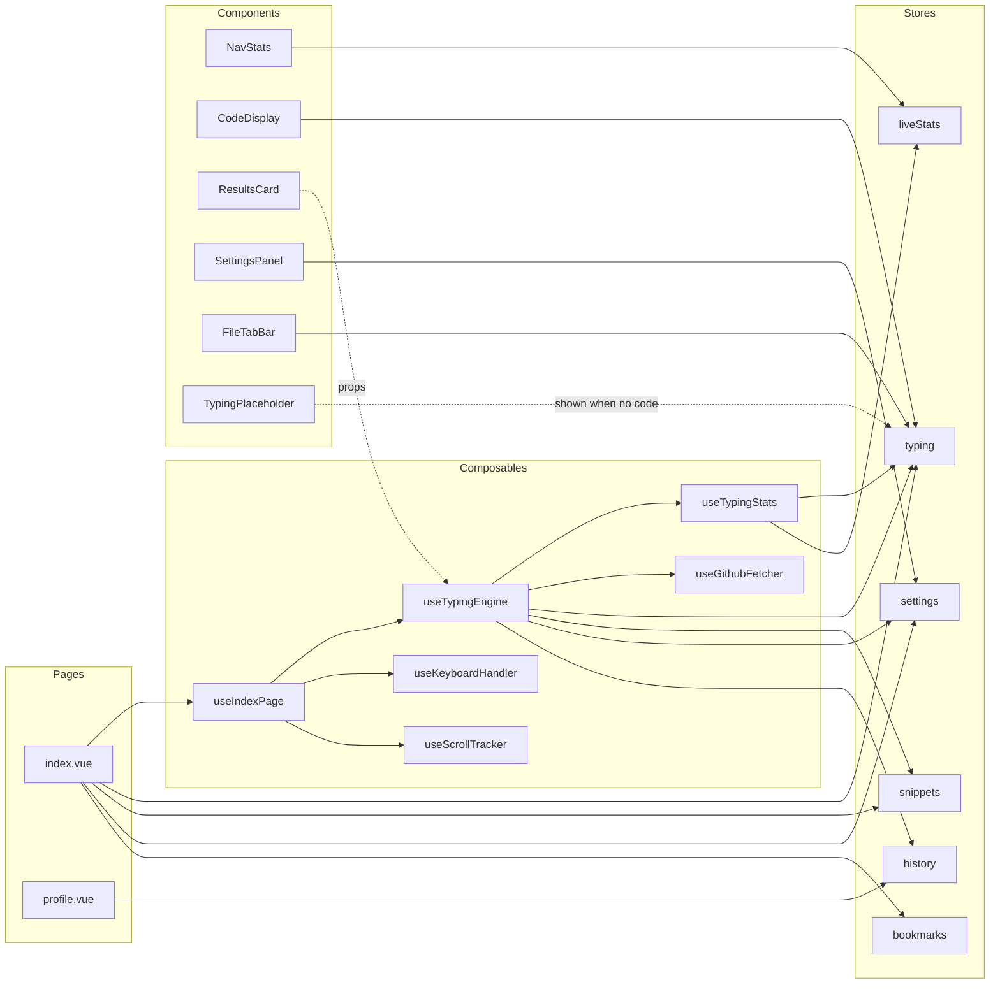
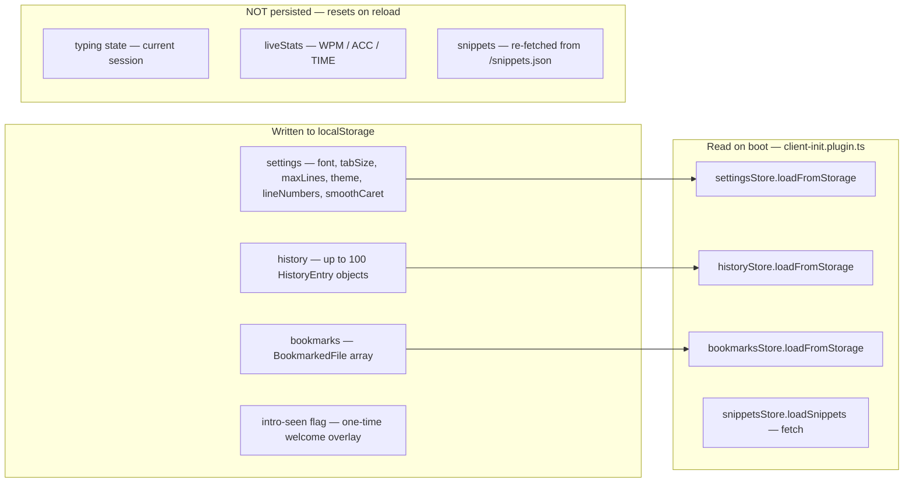

# Infrastructure Diagrams — Code Typewriter

> All diagrams use Mermaid syntax. A complete overview is given first, followed by focused sub-diagrams for each major flow.

---

## Quick Notes (Key Facts)

- **No backend.** Everything is client-side. GitHub files are fetched directly from the browser.
- **No accounts.** All persistence is `localStorage` only.
- **One orchestrator.** `useIndexPage` is the only composable `index.vue` touches directly.
- **One timer.** `useTypingStats` runs a 200 ms `setInterval` for all live stat updates.
- **One write bus.** `liveStats` store is a thin bucket — only `useTypingStats` writes to it; `NavStats` reads from it.
- **Tokenizer runs once.** After a file loads, `tokenizeCode()` in `shikiHighlighter.ts` assigns a Shiki color to every character. It never runs again mid-session (unless the theme changes).
- **`charStates` uses `shallowRef` + `triggerRef`.** Only changed characters cause re-renders in `CodeDisplay`.
- **Settings are reactive.** CSS variables are re-applied instantly on every change via `applyCssVariables()`.
- **Snippets are pre-built.** `public/snippets.json` is synced from `Prototype/snippets.json` at build time.

---

## 1 — Complete System Overview



---

## 2 — Page Load Flow



---

## 3 — Language Select + File Load Flow



---

## 4 — Custom GitHub URL Flow



---

## 5 — Keystroke Flow (What Happens When You Type)



---

## 6 — Accuracy Calculation



---

## 7 — Settings Change Flow



---

## 8 — Session Complete → Results → History Flow



---

## 9 — Store + Component Dependency Map



---

## 10 — Data Persistence Map



---

## Summary: The Core Loops

```
LOAD LOOP
  Boot → plugin → stores hydrate from localStorage + snippets.json fetched
  User clicks Start → random URL selected → GitHub fetch → tokenize → session ready

TYPING LOOP
  keydown → useKeyboardHandler → processChar → typing store mutates
  → CodeDisplay re-renders only changed char span (v-memo + shallowRef)
  → Every 200ms: useTypingStats.update → liveStats.set → NavStats reads

COMPLETION LOOP
  last char typed → completeTyping → stop timer → computeFinalStats
  → save to history → 350ms delay → ResultsOverlay shows

SETTINGS LOOP
  user changes setting → settingsStore updates → localStorage saved
  → CSS vars applied instantly to :root → UI reflects immediately
  → if maxLines changed + file loaded + not started: file reloads

PROFILE LOOP
  profile.vue mounts → reads historyStore computed props
  → historyAnalytics.ts pure functions compute aggregates on the fly
  → no extra fetch, everything from localStorage
```
