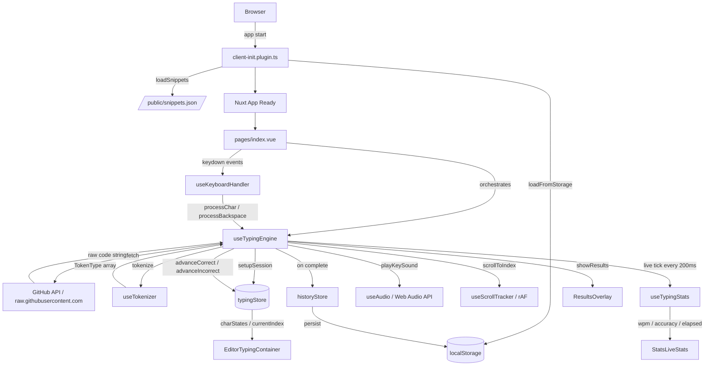
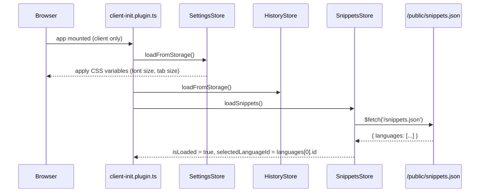
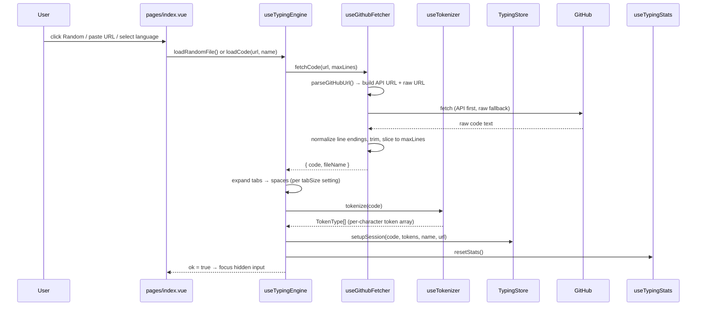
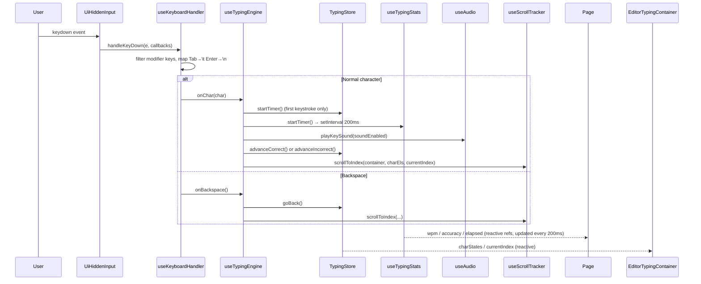
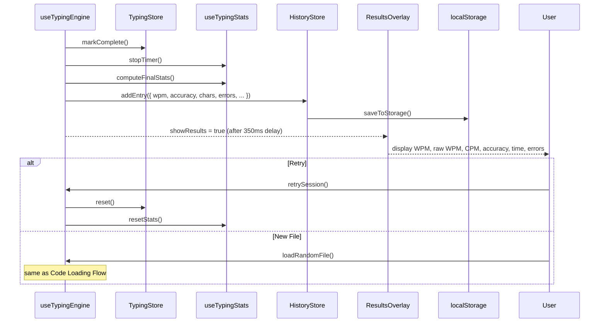
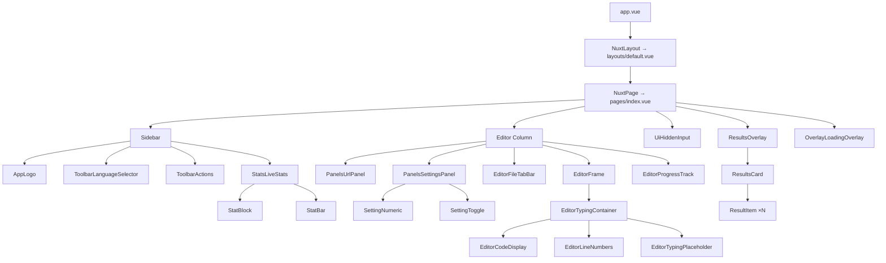
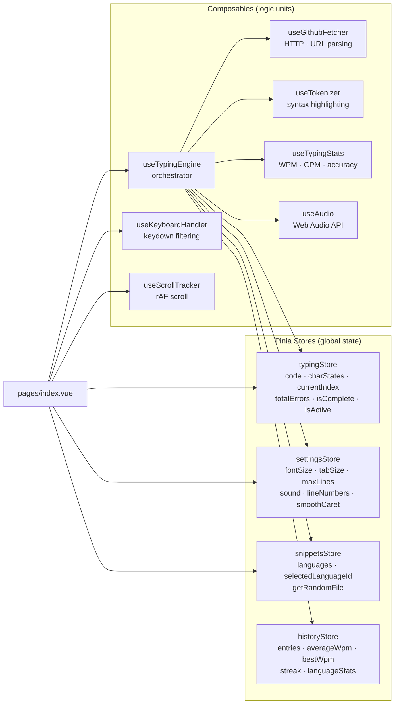
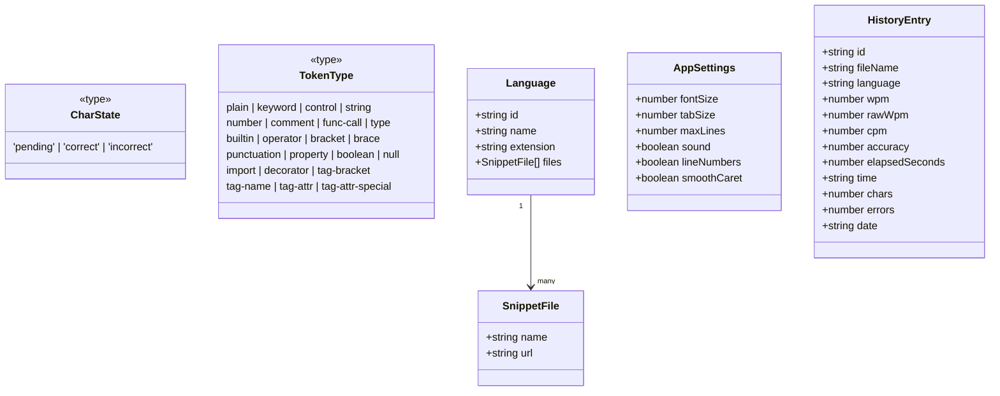
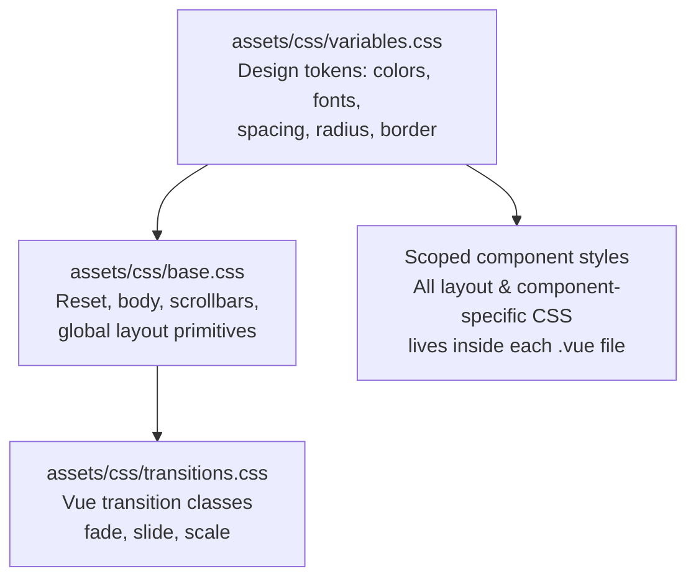

# Architecture

This document describes the structure, data flow, and component hierarchy of Code Typewriter.

---

## 1. High-Level System Overview

---

## 2. Startup Sequence

---

## 3. Code Loading Flow

---

## 4. Typing Session Flow

---

## 5. Session Completion Flow

---

## 6. Component Tree

---

## 7. State & Composable Map

---

## 8. Data Types

---

## 9. CSS Architecture

